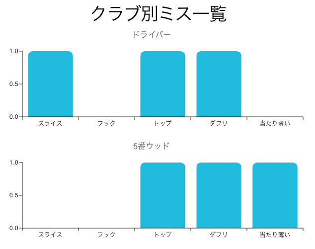
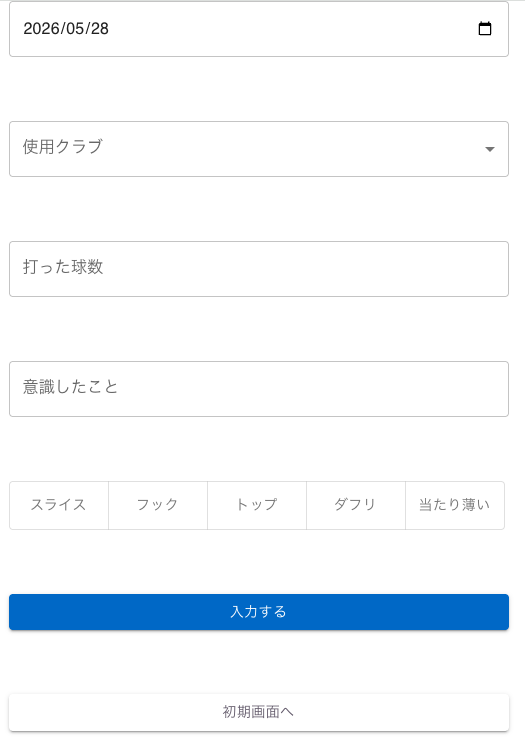
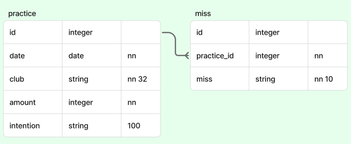

# dig-imr-10-soroMVP-golfPractice

## 概要

ゴルファーにとって、ミスは付きものです。
ですがいざ練習場にくると、自分がどんなミスをしていたのか、どんなことを意識すべきか忘れてしまうものです。
そんなゴルファーの為、練習の記録を入力し、クラブ別でミスを一覧化するアプリケーションです。

アプリのプレビュー
| 初期　 | 入力 　 |
| ------------------------- | ---------------------------- |
|  |  |

## 使用方法

- 練習場での使用を想定しているため、スマホで
  https://golfpractice.onrender.com
  にアクセスすることをおすすめします。
- クラブを変更する際に入力し、そのときに起こったミスを記録します。
- ミスは複数選択可能です。
- 初期画面にクラブ別のミス一覧が表示されています。

| スキーマ                   |
| -------------------------- |
|  |

## ローカルでの使用方法

- このレポジトリをクローンした後、 `npm install` を実行して必要なパッケージをインストールしてください。
- 開発時は `nodemon` を使用すると便利です。 `npm install nodemon -D` を実行してインストールしてください。
- ローカル環境で Postgres が起動している必要があります。Postgresのインスタンスを起動し、 `golfpractice` というデータベースを作成してください。
- > **補足**: データベースを作成するための `psql` クエリは `CREATE DATABASE golfpractice;` です。
- データベースに接続するために、環境変数の設定が必要です。
  ルートディレクトリで `.env`ファイルを作成し、以下のコードを記載してください。
  > DB_USER='user'
  > DB_NAME='golfpractice'
  > NODE_ENV='development'
- `npm run db:migrate` を実行して、データベースの状態を最新にしてください。
  > **注意**: この段階で一番多いエラーはデータベース接続エラーです。マイグレーションが失敗した場合は、Postgres が起動しているか、また `/knexfile.js` に設定されている Postgresのユーザー名・パスワードが実際の環境と一致しているかを確認してください。
- `npm run db:seed` を実行して、シードデータ（初期データ）を投入してください。
- `npm run dev` を実行してアプリを起動し、ブラウザで `localhost` にアクセスしてください（ポート番号は `server.js` に記載されています）。
  - シードデータ投入後、ミスデータが表示されていますか？アプリを操作してどのように動作するか見ておきましょう。もし、ミスデータが表示されない場合は、シードデータの投入に失敗しています。

## 将来の計画

- クラブ別入力データ一覧の表示
- 記録の一覧、削除
- 表示期間、クラブの設定
- 動画撮影、保存
